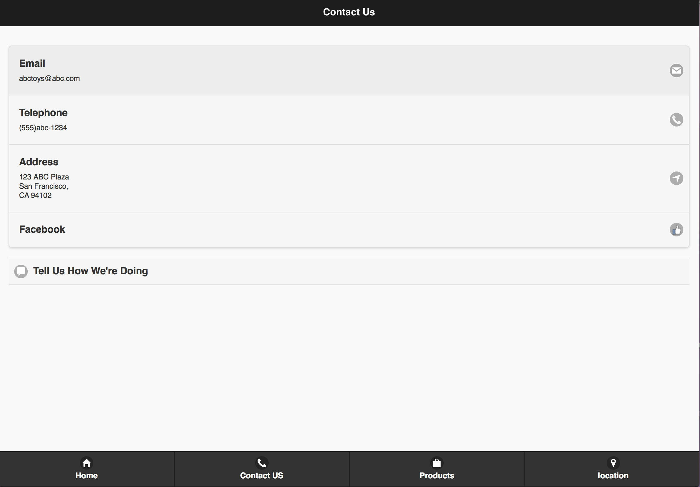
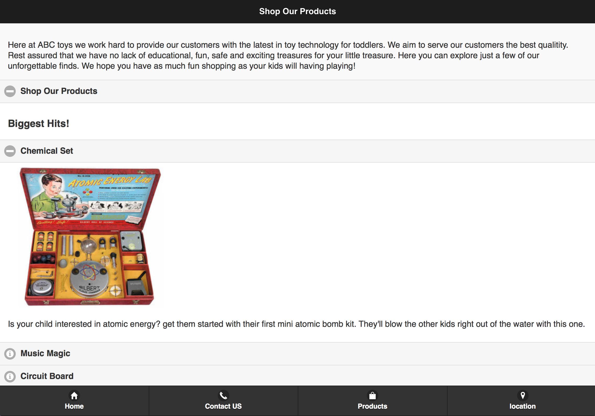
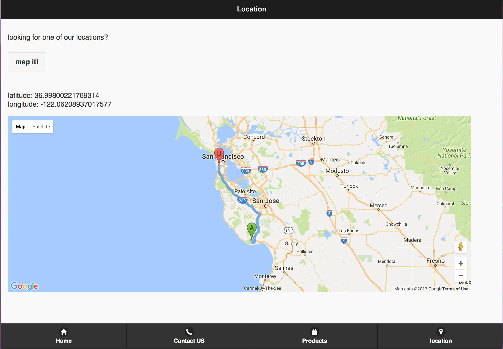

# mobileToyStore

 my home pages contains a small description of the webpage and contains navigation buttons to all the other parts of my website. The UI was designed using the JQuery UI

 I also used built in and custom icons for a contact page.

Finally, I also used the Google Maps API to create a map that routes a user from their current location to some remote location that I used as a place holder for the "toy store". The users latitute and logitude are also written to the webpage.

