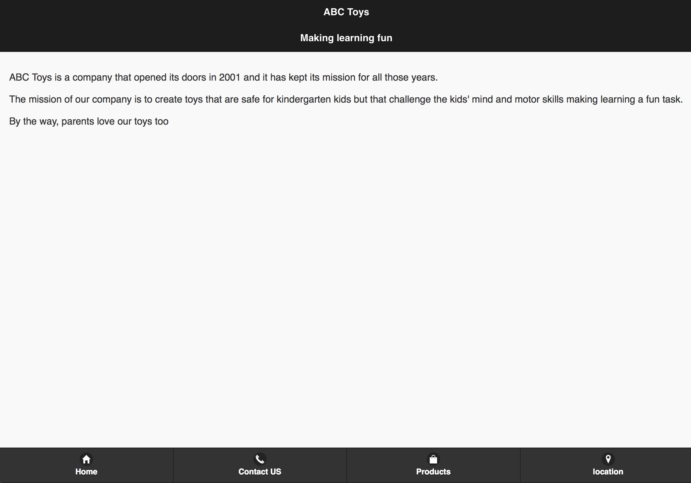

# mobileToyStore
This was created as an assignment for a mobile web app design class. Uses the JQuery Mobile UI and the google maps API

<h1> Check out the final product </h1>

 my home pages contains a small description of the webpage and contains navigation buttons to all the other parts of my website. The UI was designed using the JQuery UI

